

# HR Phone Book

## Description
Command line application for tracking and updating organizational hierarchy information.

## Table of Contents

* [Walkthrough](#walkthrough)
* [Technologies](#technologies)
* [Future Enhancements](#future-enhancements)
* [License](#license)

## Walkthrough
A walkthrough video for this application can be found here: https://drive.google.com/file/d/1WI_4ummyjcYmSacXIXGyGjorNcV-GqOx/view?usp=sharing

1. Once you have downloaded and extracted the files, and installed npm dependencies, run "node phonebook.js" to kick off the application. You will be presented with several choices to interact with the HR data available in the SQL database.

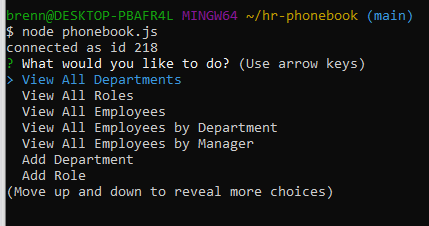

2. Selecting to view all Departments displays a table of the Department ID and Name:

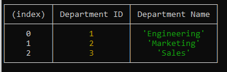

3. Selecting to view all Roles displays a table of the Role ID, Name, and Salary:

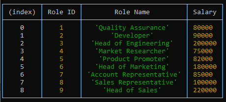

4. Selecting to view all Employees displays a table of the Employee Name, Role, Department, Salary, and Manager.

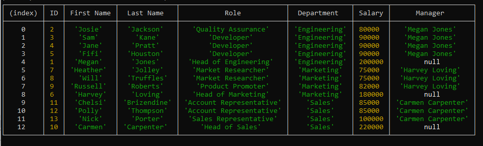

5. Selecting to view Employees by Departments displays a table of the Departments sorted on the left with the employee information on the right.

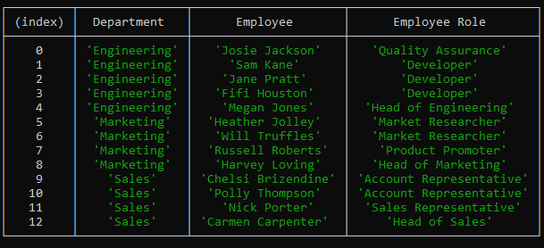

6. Selecting to view Employees by Manager displays a table of the Managers sorted on the left with the employee information on the right.

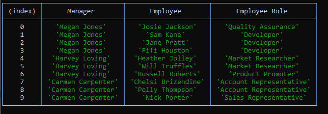

7. Selecting to add a department prompts you for the new Department Name and presents a success message after it is added. You can revist the View All Departments option to see the new entry.

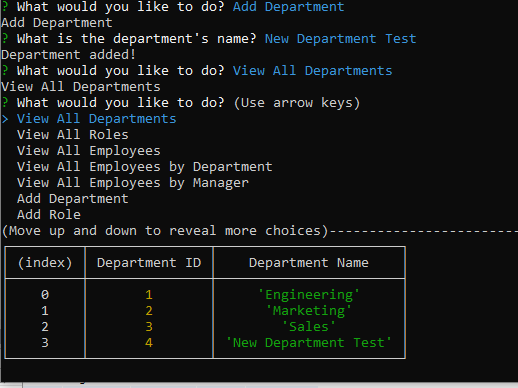

8. Selecting to add a role prompts you for the new role Name, Salary, and related Department ID, and presents a success message after it is added. You can revist the View All Roles option to see the new entry.

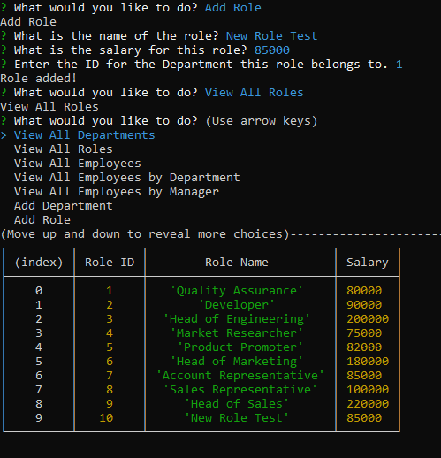

9. Selecting to add an employee prompts you for the new employee Name, Role, and Manager, and presents a success message after they are added. You can revist the View All Employees option to see the new entry.

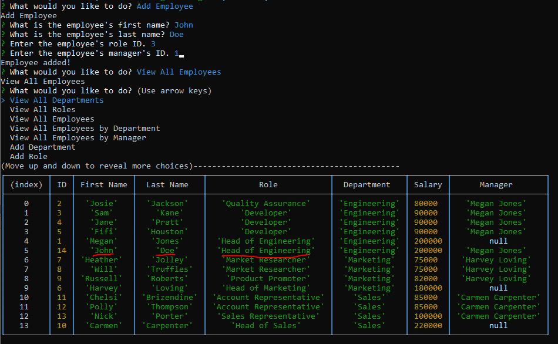

10. In the example above, say John Doe was mistakenly added as the Head of Engineering, but should have been listed as a Developer. Selecting the Update Employee Role option allows you to provide a different Role ID to a given Employee ID.

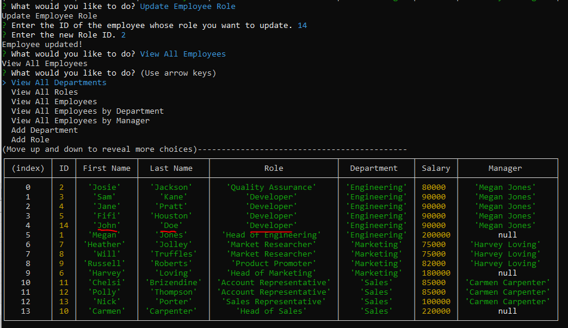

11. When selecting to remove an employee, you are presented with a list of current employees that you can use to choose and employee for deletion. In this case, Josie Jackson was selected for deletion and no longer appears in the list of employees.

12. The final option is to Exit the application, at which point you are presented with a goodbye message and the connection to the database ends.

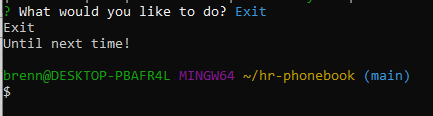

## Technologies

This application uses mysql and javascript to present the user with HR data for view and manipulation. Command Line/GitBash, node.js, inquirer, and mysql are needed to run the application.

## Future Enhancements

To improve this application, I plan to implement chalk to add color to the command line output, a way to remove the Departments and Roles, and additional data views to splice and dice the data as desired.

## License

MIT License

Copyright (c) 2021 KU Coding Bootcamp

Permission is hereby granted, free of charge, to any person obtaining a copy
of this software and associated documentation files (the "Software"), to deal
in the Software without restriction, including without limitation the rights
to use, copy, modify, merge, publish, distribute, sublicense, and/or sell
copies of the Software, and to permit persons to whom the Software is
furnished to do so, subject to the following conditions:

The above copyright notice and this permission notice shall be included in all
copies or substantial portions of the Software.

THE SOFTWARE IS PROVIDED "AS IS", WITHOUT WARRANTY OF ANY KIND, EXPRESS OR
IMPLIED, INCLUDING BUT NOT LIMITED TO THE WARRANTIES OF MERCHANTABILITY,
FITNESS FOR A PARTICULAR PURPOSE AND NONINFRINGEMENT. IN NO EVENT SHALL THE
AUTHORS OR COPYRIGHT HOLDERS BE LIABLE FOR ANY CLAIM, DAMAGES OR OTHER
LIABILITY, WHETHER IN AN ACTION OF CONTRACT, TORT OR OTHERWISE, ARISING FROM,
OUT OF OR IN CONNECTION WITH THE SOFTWARE OR THE USE OR OTHER DEALINGS IN THE
SOFTWARE.